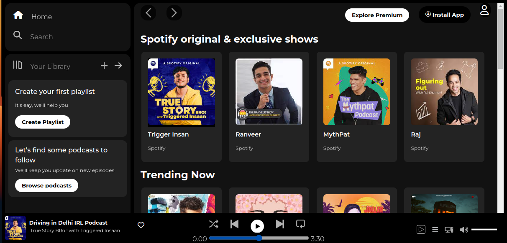

# Spotify Clone using HTML and CSS



This project is a simple Spotify clone created using only HTML and CSS. It aims to replicate the basic user interface of the Spotify web player.

## Features

- Responsive design for various screen sizes.
- Header section with navigation links.
- Sidebar with playlist categories.
- Main content area to display albums and tracks.
- Stylish buttons and icons.

## How to Run

1. Clone the repository to your local machine using the following command:
   ```
   git clone https://github.com/your-username/spotify-clone.git
   ```

2. Navigate to the project directory:
   ```
   cd spotify-clone
   ```

3. Open the `index.html` file in your preferred web browser.

## Screenshots

### Desktop View


### Mobile View


## Contributing

Contributions are welcome! If you find any bugs or want to add new features, feel free to submit a pull request.

## License

This project is licensed under the [MIT License](LICENSE).

---

**Note:** This project is for educational purposes only and is not affiliated with Spotify or any official Spotify products or services.
